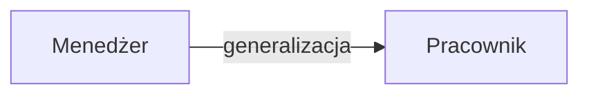
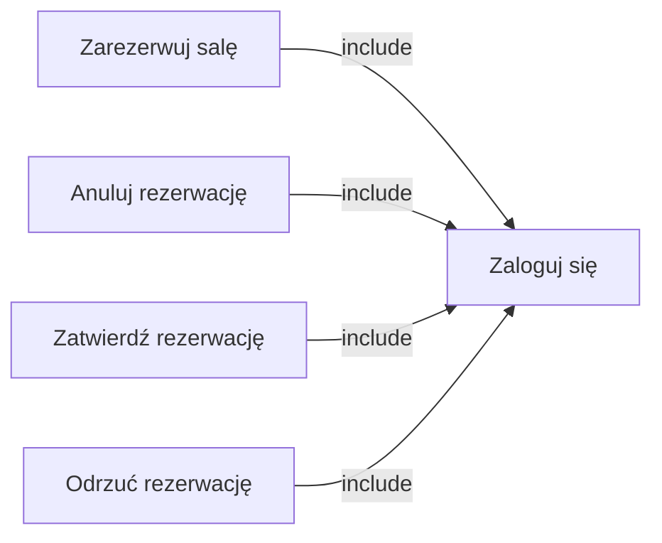
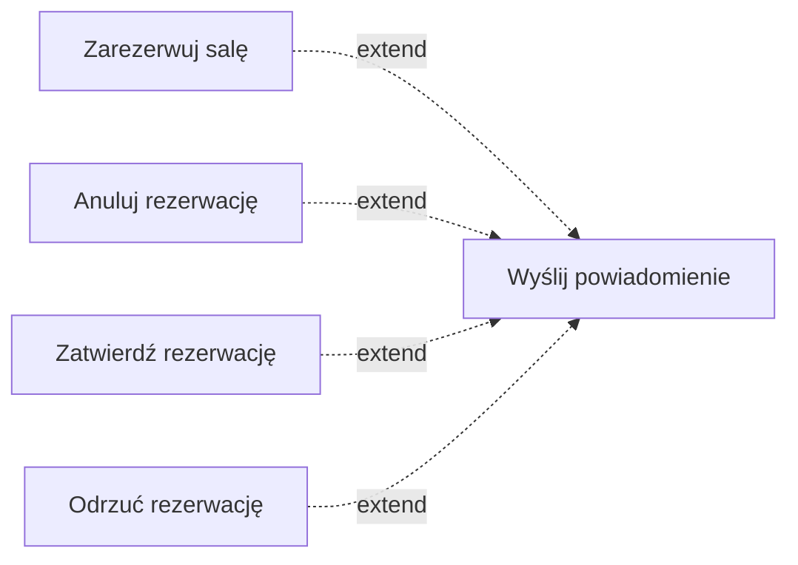
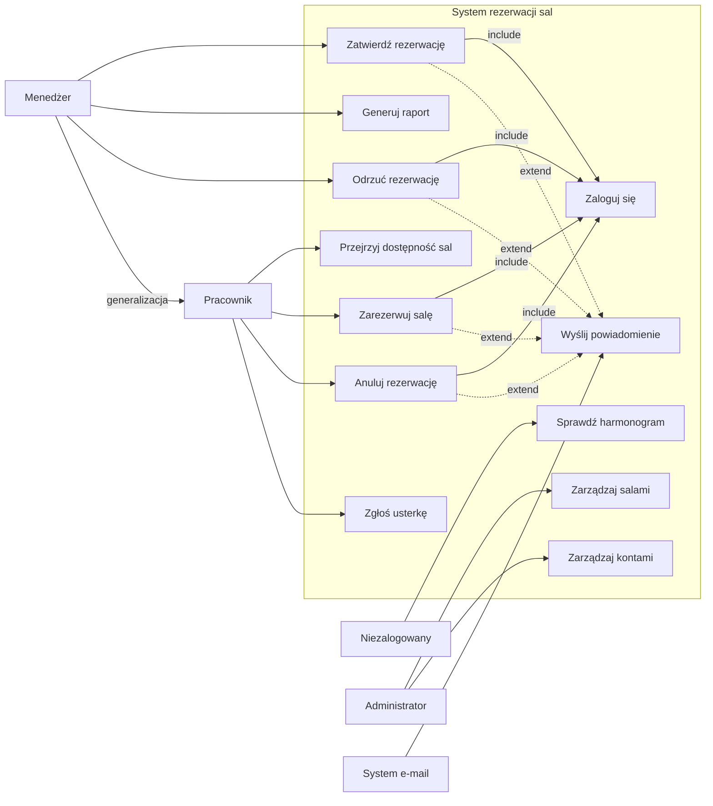

# IW 5 – Modelowanie wymagań

## Zadanie 1 – System rezerwacji sal konferencyjnych

---

## a) Aktorzy systemu

### Aktorzy bezpośredni

- Pracownik
- Menedżer
- Administrator
- Niezalogowany użytkownik

Aktor bezpośredni korzysta z systemu przez interfejs i sam wykonuje akcje.

### Aktor pośredni

- System e-mail

Aktor pośredni współpracuje z systemem automatycznie. W tym przypadku system e-mail wysyła powiadomienia po zmianie statusu rezerwacji.

---

## b) Błędy i braki w diagramie

### Błąd 1 – brak generalizacji Menedżera do Pracownika

W opisie systemu jest informacja, że Menedżer ma wszystkie uprawnienia Pracownika. W diagramie trzeba więc dodać generalizację.

Poprawka:

### Błąd 2 – brakujące include do logowania

Czynności takie jak rezerwacja, anulowanie, zatwierdzanie i odrzucanie wymagają zalogowania.

Poprawka:

### Błąd 3 – niepełne powiązanie powiadomień ze zmianami statusu

Powiadomienie powinno być wysyłane po każdej zmianie statusu rezerwacji, czyli po złożeniu, zatwierdzeniu, odrzuceniu albo anulowaniu.

Poprawka:

---

## c) Dopisanie przypadku użycia „Odrzuć rezerwację”

Przypadek użycia „Odrzuć rezerwację” wykonuje Menedżer, ponieważ to on decyduje o rezerwacjach wymagających akceptacji, na przykład rezerwacjach sal VIP.

### Poprawiony diagram UC

---

## d) Czy „Wyślij powiadomienie” powinno być przypadkiem użycia?

„Wyślij powiadomienie” nie jest bezpośrednim celem użytkownika systemu. Użytkownik chce zarezerwować salę, anulować rezerwację albo podjąć decyzję o zatwierdzeniu lub odrzuceniu rezerwacji. Wysłanie wiadomości e-mail jest automatyczną reakcją systemu na zmianę statusu.

Lepszym rozwiązaniem jest traktowanie powiadomień jako procesu wewnętrznego systemu albo jako zdarzenia wykonywanego po zakończeniu innych przypadków użycia. Dzięki temu diagram skupia się na działaniach aktorów i pozostaje czytelny.